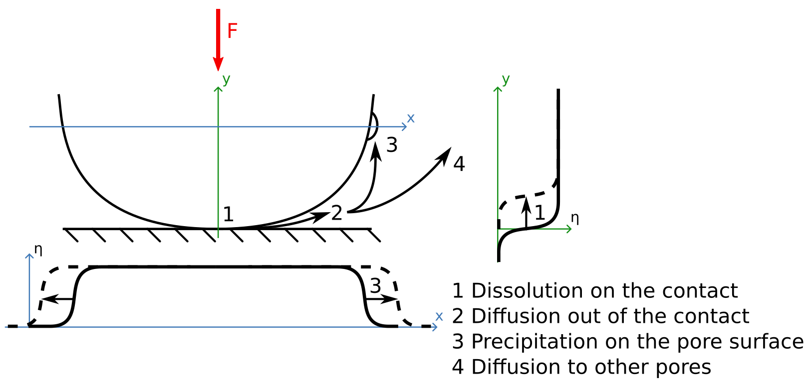
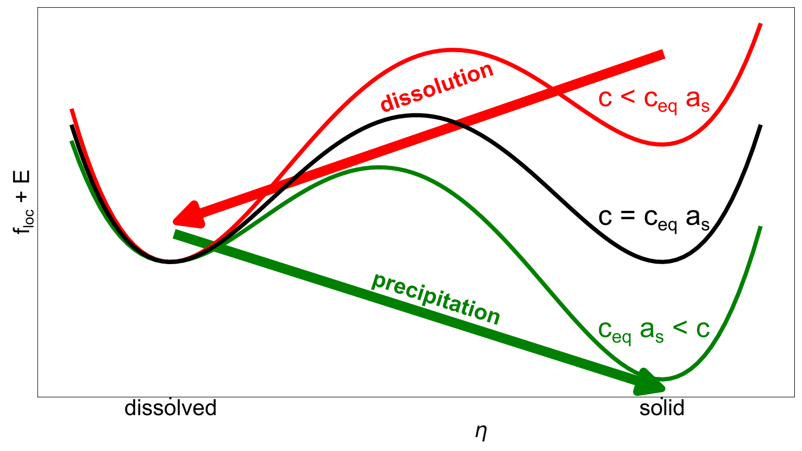
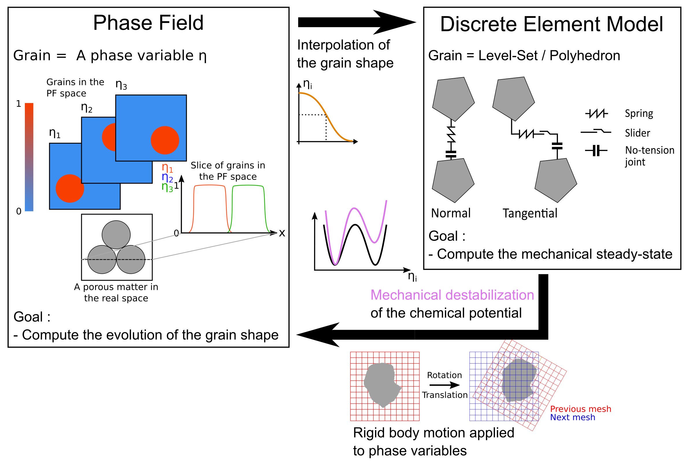
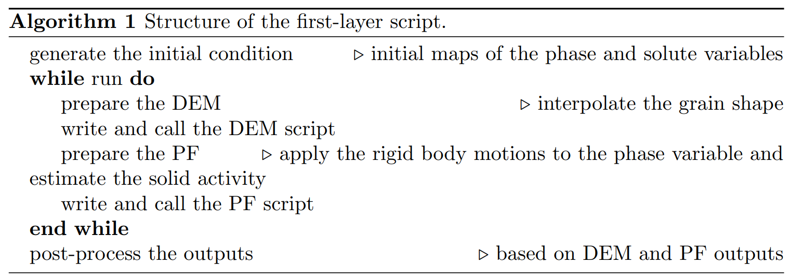
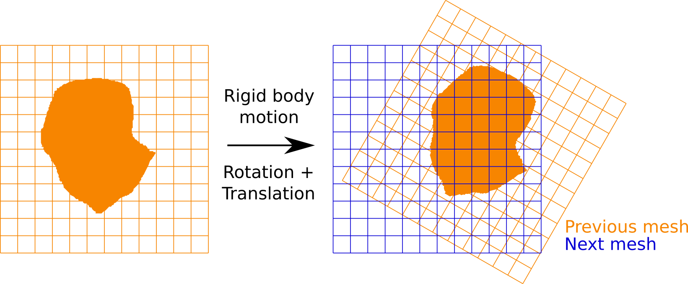

# Coupling the Phase-Field approach with a Discrete Element Model to investigate Pressure-Solution

TODO add download

## Problem description

Even if most of the materials appear homogeneous, they are heterogeneous at smaller scales.
For geomaterials, this smaller scale is at the level of the microstructure and it consists of grains (that can differ in minerals) and pores.
This microstructure is fundamental as the organization and the elements that compose it determine the multiphysical properties at the scale of the material.
Furthermore, this microstructure is affected by external solicitations and evolves with time.
Then, it becomes essential to predict the microstructure evolution.
A relevant example of this change in porous geomaterials is the pressure-solution phenomenon.
As depicted in [Figure 1], three fundamental chemo-mechanical processes at the microscale are involved: (1) dissolution due to stress concentration at grain contacts, (2) diffusive transport of dissolved mass from the contact to the pore space, and (3) precipitation of the solute on the less stressed surface of the grains.

<a id="fig-configuration"></a>



***Figure 1:** Definition of the configuration and description of the microstructure with a phase variable.*


### Phase-Field description

Among the methods available in the literature, the phase-field approach emerges as an efficient and accurate tool for this prediction of the microstructure evolution due to multiphysical solicitations. 
This new example is a continuation of the previously modeled [dissolution, diffusion, and precipitation pattern](../case3_dissolution_diffusion_precipitation/case3_dissolution_diffusion_precipitation.md)

The dissolution/precipitation of the solid phase can be described by an Allen-Cahn equation, available in Eq. 1. 
This equation is applied to a phase variable $\eta$ ($=1$ if the point corresponds to the solid phase, $=0$ if the point corresponds to the pore space).

\[
    \frac{\partial\eta}{\partial t}=-L\,\frac{\partial\left(f_{loc}+E_d\right)}{\partial \eta} + L\cdot\kappa\,\nabla^2\eta
    \label{Equation Allen Cahn}
    \tag{1}
\]

In particular, this equation involves a free energy function $f_{loc}$ that describes the material and depends on the mineral. 
This free energy function is destabilized by a tilting energy function $E$, inducing the evolution of the microstructure, as depicted in [Figure 2] and formulated in Eq. 2. 
The additional parameters $L$ and $\kappa$ from Eq. 1 affect the interface width and the kinetics of the phenomenon.

<a id="fig_floc_ed"></a>


{ width="60%" }

***Figure 2:** Destabilization of the free energy $f_{loc}$ by the tilting energy $E$.*

\[
    f_{loc}+E(c) = W\times\left(\eta^2(1-\eta)^2\right) + ed(c)\times\left( 3\eta^2-2\eta^3\right)
    \label{Equation free energy}
    \tag{2}
\]

where $W$ is the barrier energy, preventing the phase transition, and $ed$ the tilting amplitude, inducing the phase transition. 
The amplitude of the tilting is dictated by the value of a new variable $c$ that describes the concentration of a reactive specimen in the pore fluid.
In the context of this model, the propagation of this solute is described by Eq. 3.

\[
    \frac{\partial c}{\partial t} = -\alpha_\textit{source} \frac{\partial \textit{source}}{\partial t} -\alpha_\textit{product} \frac{\partial \textit{product}}{\partial t} + \kappa_c \nabla^2 c
    \label{Equation Diffusion c}
    \tag{3}
\]

the terms $\frac{\partial c}{\partial t} = \kappa_c \nabla^2 c$ represent the diffusive propagation of the solute, and the terms $\alpha_\eta \frac{\partial \eta}{\partial t}$ ensure the conservation of the mass during the dissolution/precipitation of the solid.

Subsequently, by assuming the chemical reaction $\left(\eta_s \rightleftharpoons c_l\right)$ at a fixed pressure $P$, the chemical quotient of the reaction is $Q=\frac{\{c\}}{\{\eta\}}=c$.
In the same note, the equilibrium constant is $K=c_{eq}(P)$, which is pressure-dependent.
The dissolution of a solid phase occurs for $Q<K$ ($c<c_{eq}$) and the precipitation of a solid phase occurs for $Q>K$ ($c>c_{eq}$).
Furthermore, the kinetics of the reactions depend on the distance to the equilibrium, see Eq. 4.

\[
    E = \chi_{diss/prec}\times a_s\times \left(1 - \frac{c}{c_{eq}\,a_s}\right)\times \left(3\eta^2-2\eta^3\right)
    \label{Equation E}
    \tag{4}
\]

where $\chi_{diss/prec}$ is a constant relative to the global kinetics of the reaction (dissolution or precipitation) and $a_s$ is the solid activity that is defined in Eq. 5.

\[
    a_s = \text{exp}\left(\frac{P\times V_m}{RT}\right)
    \label{Equation as}
    \tag{5}
\]

where P is the pressure at the contact, $V_m$ is the molar volume, $R$ is the gas constant, and $T$ is the temperature.
The solid activity $a_s$ appears to increase in proportion to the stress transmitted at the contact. This modification affects the value of the solute concentration at equilibrium $c_{eq}\, a_s$.
The established chemical equilibrium in the fluid film ($c$ versus $c_{eq}\,a_s$) becomes unverified.
The material dissolves in the contact zone to reach the chemical equilibrium $c=c_{eq}\,a_s$.
A gradient in the solute concentration values appears between the contact zone $c=c_{eq}\,a_s$ and the pore space $c = c_{eq}$.
This gradient gives rise to the diffusion of the solute.
Subsequently, the established chemical equilibrium in the pore space ($c$ versus $c_{eq}$) becomes unverified. The material precipitates in the pore space to reach the chemical equilibrium $c=c_{eq}$.


As illustrated by Figure 1, the dissolution of the solid can remove a pre-existing contact.
Subsequently, the grains, which are loaded, should reorganize to reach a new mechanical steady-state (in the case depicted herein, the particle moves down to retrieve the contact).
It is essential to emphasize that the Phase-Field formulation itself is not able to compute the granular mechanical steady-state and interpolate the stress at the contacts.
Thus, the idea is to couple this approach with another method that has these abilities: the Discrete Element Model.

### Discrete Element Model

The Discrete Element Model has been developed to account for the individual grains and their interactions.
In particular, the momentum balances (see Eq. 6) are solved for each grain, considering the external forces applied to the system $f/M^{external}$ and the transmitted forces interpolated at the contacts $f/M^{contacts}$. 
These contact forces are determined through a penalization method based on an overlap $\delta$ between the grains.
It is essential to specify that this overlap $\delta$ can be based on a characteristic distance or volume of the contact.

$$
\begin{align*}
    m\,\frac{\partial v_i}{\partial t}&=f_i^{external} + f_i^{contacts}(\delta)\nonumber\\
    I\,\frac{\partial w_i}{\partial t}&=M_i^{external} + M_i^{contacts}(\delta)
    \label{Equation Momentum}
    \tag{6}
\end{align*}
$$

where $m$ is the mass of the grain, $v_i$ the particle velocity (with Einstein's notation), $I$ is the moment of inertia of the grain, and $w_i$ is the angular velocity .

In the case depicted in Figure 1, the granular reorganization remains trivial: the grain moves down until it verifies the overlap $\delta$ that corresponds to the external force applied $F$.
In a more complex configuration (which is common in the literature), this reorganization should be estimated with dedicated solvers such as [Yade](https://yade-dem.org/doc/).

### Description of the Phase-Field Discrete Element Method

The data exchange and global scheme of the Phase-Field Discrete Element Method are depicted in [Figure 3].
In summary, the Discrete Element Model is used to compute a mechanical steady-state, whereas the Phase-Field disturbs this equilibrium by changing the shape of the grains.

<a id="fig-pfdem"></a>



***Figure 3:** Concept of the Phase-Field Discrete Element Method.*

In particular, a grain detection algorithm is employed to ascertain the novel grain shape based on the Phase-Field outputs.
These polygonal particles are used in the Discrete Element Model to compute the new mechanical steady-state.
Once this new granular organization is determined, new phase maps are interpolated in order to update the geometry of the Phase-Field problem.
Simultaneously, the tilting term $e_d$ is determined through the solid activity $a_s=F/S$, where $S$ is the contact surface.

---

## Model set up

### A two-solvers approach

As depicted in [Figure 3], the Phase-Field Discrete Element Method consists in coupling two distinct approaches: the Phase-Field and the Discrete Element Model.
Thus, the global approach is based on a first-layer code that is able to generate, call, and read second-layer codes that are used for the Phase-Field and the Discrete Element Model.

The first-layer code presented herein is a Python script and follows the structure
described in Algorithm 1.

<a id="algo-firstlayer"></a>



The initial condition consider the configuration depicted in [Figure 1]: a single grain under the pressure-solution phenomenon.

```text
def define_ic(dict_user, dict_sample):
    '''
    Define the initial conditions for the simulation.

    dict_sample['x_L', 'y_L', 'pos_1', 'eta_1_map', 'c_map'] are created
    '''
    # create the mesh
    dict_sample['x_L'] = np.linspace(dict_user['x_min'], dict_user['x_max'], dict_user['n_mesh_x'])
    dict_sample['y_L'] = np.linspace(dict_user['y_min'], dict_user['y_max'], dict_user['n_mesh_y'])

    # position of the grain
    dict_sample['pos_1'] = [0, dict_user['radius']]

    # initialize and compute the phase map
    dict_sample['eta_1_map'] = np.zeros((dict_user['n_mesh_y'], dict_user['n_mesh_x']))
    # iterate over x
    for i_x in range(len(dict_sample['x_L'])):
        x = dict_sample['x_L'][i_x]
        # iterate over y
        for i_y in range(len(dict_sample['y_L'])):
            y = dict_sample['y_L'][i_y]
            # distance to grain center
            d_node_to_g1 = np.linalg.norm(np.array([x,y])-np.array(dict_sample['pos_1']))
            # compute the phase variable
            if d_node_to_g1 <= dict_user['radius']-dict_user['w_int']/2 : # inside the grain
                dict_sample['eta_1_map'][-1-i_y, i_x] = 1
            elif dict_user['radius']-dict_user['w_int']/2 < d_node_to_g1 and d_node_to_g1 < dict_user['radius']+dict_user['w_int']/2: # in the interface
                dict_sample['eta_1_map'][-1-i_y, i_x] = 0.5*(1+math.cos(math.pi*(d_node_to_g1-dict_user['radius']+dict_user['w_int']/2)/dict_user['w_int'])) # a cosine profile is assumed
            elif dict_user['radius']+dict_user['w_int']/2 <= d_node_to_g1 : # outside the grain
                dict_sample['eta_1_map'][-1-i_y, i_x] = 0 

    # initialize and compute the solute map
    dict_sample['c_map'] = np.zeros((dict_user['n_mesh_y'], dict_user['n_mesh_x']))
    for i_x in range(len(dict_sample['x_L'])):
        for i_y in range(len(dict_sample['y_L'])):
            dict_sample['c_map'][-1-i_y, i_x] = 1 # system at the equilibrium initialy
```

In particular, the initial map of the phase variable that represents the grain is estimated with a cosine profile detailed below. 
In the same tone, the solute concentration is set to be at the equilibrium in the entire domain. 
Thus, the dissolution of the solid at the contact is induced by the mechanical destabilization (and not a preexisting unequilibrate state).

$$
\begin{align}
        &=1 \text{ if } d \leq - \delta/2 \text{ (inside the grain)}\nonumber\\
    \eta&=0.5\left(1+\text{ cos}\left(\pi\frac{d+\delta/2}{\delta}\right)\right)\text{ if } |d|<\delta/2\label{Eq Cosine Profile} \text{ (in the interface of the grain)}\\
        &=0 \text{ if } d \geq \delta/2 \text{ (outside the grain)}\nonumber
\end{align}
$$

The rest of the script, and in particular the different steps required during an iteration, is detailed in the following sections.

### Prepare the Discrete Element Model (first-layer code)

The PFDEM iteration starts with a preparation of the DEM simulation. 
In the example depicted herein, this step is not necessary.
The main idea is to interpolated the shape of grains from the field of the phase variable. 
This shape can be represented by a polyhedral or a Level-Set function.

```text
def prepare_dem(dict_user, dict_sample):
    '''
    Prepare the DEM simulation.

    The shape of the grains is interpolated from the Phase-Field map.
    This shape can be represented by a polyhedral or by a Level-Set function.

    In the configuration investigated here, this step is not necessary as the home made solver (see run_dem()) uses directly the phase-field map.
    '''
    pass
```

### In-house solver for the Discrete Element Model

The goal of the DEM simulation is to estimate the mechanical steady-state.
Here, an in-house solver is used in the example depicted, as the configuration is trivial (a single grain).
A more complex configuration could require the use of more developed solvers such as [Yade](https://yade-dem.org/doc/).

```text
def run_dem(dict_user, dict_sample):
    '''
    Run the DEM simulation.

    Here an home made solver is used. More complex configurations could require the use of more developped solvers such as YADE.
    The idea is to determine the y coordinates that respect the imposed contact volume.
    '''
    # start the investigation from the bottom
    i_y = 0
    # compute the contact volume at this current coordinate
    contact_volume = dict_sample['eta_1_map'][-1-i_y,:].sum()*(dict_sample['x_L'][1]-dict_sample['x_L'][0])*(dict_sample['y_L'][1]-dict_sample['y_L'][0])*1
    # save the previous contact volume
    contact_volume_prev = 0
    # compare the contact volume to the imposed solicitation
    while contact_volume < dict_user['imposed_contact_volume']:
        # iterate over the y coordinates
        i_y = i_y + 1
        # update the contact volume and the previous contact volume
        contact_volume_prev = contact_volume
        contact_volume = contact_volume + dict_sample['eta_1_map'][-1-i_y,:].sum()*(dict_sample['x_L'][1]-dict_sample['x_L'][0])*(dict_sample['y_L'][1]-dict_sample['y_L'][0])*1
    # interpolate the y coordinate to respect the imposed contact volume
    # this value is the displacement of the grain computed by the DEM simulation
    dict_sample['displacement'] = np.array([0, -(dict_sample['y_L'][i_y-1] + (dict_user['imposed_contact_volume']-contact_volume_prev)/(contact_volume-contact_volume_prev)*(dict_sample['y_L'][i_y]-dict_sample['y_L'][i_y-1]))])
```

The main output of this simulation is the new granular configuration. 
Comparing the initial and the final states, a rigid body motion (translation+rotation) can be determined. 
This motion should be applied in parallel to the field of the phase variable to ensure that it remains representative (see the next Section).
The stress transmission at the final state is also used to determine the tilting energy that destabilizes the solid phase in the Phase-Field simulation (see Section the next Section).

### Prepare the Phase-Field (first-layer code)

The next step is to prepare the Phase-Field simulation. 
The main philosophy of this part is depicted in the following. 
The details of the functions called will not be described in this tutorial, but are available in the online repository (TO DO make link).
In brief, this preparation step consists of updating the phase variable field, updating the solute field, characterizing the contact, computing the solid activity field, and computing the diffusivity field.

```text
def prepare_pf(dict_user, dict_sample):
    '''
    Prepare the Phase-Field simulation.
    '''
    # Update the phase map of the grain
    update_phase_map(dict_user, dict_sample) # see prepare_pf_lib.py

    # Update the solute map
    update_solute_map(dict_user, dict_sample) # see prepare_pf_lib.py

    # Characterize the contact
    characterize_contact(dict_user, dict_sample) # see prepare_pf_lib.py

    # Compute the solid activity map
    compute_as_map(dict_user, dict_sample) # see prepare_pf_lib.py

    # Compute the diffusivity map
    compute_diffusivity_map(dict_user, dict_sample) # see prepare_pf_lib.py
```

### MOOSE for the Phase-Field

Then, the Phase-Field simulation is called.

```text
def run_pf(dict_user, dict_sample):
    '''
    Run the Phase-Field simulation with the solver MOOSE.
    '''
    # create a folder dedicated to the MOOSE simulation
    create_folder('MOOSE_simulation')

    # write the variables maps required for the MOOSE simulation
    write_map_txt(dict_user, dict_sample, 'eta_1_map') # see run_pf_lib.py
    write_map_txt(dict_user, dict_sample, 'c_map') # see run_pf_lib.py
    write_map_txt(dict_user, dict_sample, 'as_map') # see run_pf_lib.py
    write_map_txt(dict_user, dict_sample, 'kc_map') # see run_pf_lib.py

    # write the MOOSE input file
    write_moose_input_file(dict_user, dict_sample) # see run_pf_lib.py

    # run MOOSE to solve the PF
    os.system('mpiexec -n '+str(dict_user['n_proc'])+' ~/projects/moose/modules/phase_field/phase_field-opt -i Case4_PFDEM.i')

    # sort the output
    os.rename('Case4_PFDEM.i', 'MOOSE_simulation/Case4_PFDEM.i')
    os.rename('Case4_PFDEM_out.e', 'MOOSE_simulation/Case4_PFDEM_out.e')
    # iterate on the.vtu (one per processor)
    for i_proc in range(dict_user['n_proc']):
        # configuration before PF simulation
        os.rename('Case4_PFDEM_other_000_'+str(i_proc)+'.vtu',\
                  'vtk/Case4_PFDEM_other_'+index_to_3str((dict_sample['i_PFDEM_ite']-1)*2)+'_'+str(i_proc)+'.vtu')
        # configuration after PF simulation
        os.rename('Case4_PFDEM_other_001_'+str(i_proc)+'.vtu',\
                    'vtk/Case4_PFDEM_other_'+index_to_3str((dict_sample['i_PFDEM_ite']-1)*2+1)+'_'+str(i_proc)+'.vtu')
    # write a new pvtu from the previous one
    adapt_pvtu('Case4_PFDEM_other_000.pvtu', index_to_3str((dict_sample['i_PFDEM_ite']-1)*2)) # see run_pf_lib.py
    adapt_pvtu('Case4_PFDEM_other_001.pvtu', index_to_3str((dict_sample['i_PFDEM_ite']-1)*2+1)) # see run_pf_lib.py
    # move the previous pvtu into the bin folder
    os.rename('Case4_PFDEM_other_000.pvtu',\
              'MOOSE_simulation/Case4_PFDEM_other_000.pvtu') 
    os.rename('Case4_PFDEM_other_001.pvtu',\
              'MOOSE_simulation/Case4_PFDEM_other_001.pvtu') 
    # read the maps
    read_vtk(dict_user, dict_sample, index_to_3str((dict_sample['i_PFDEM_ite']-1)*2+1))
    # clean the unused output
    shutil.rmtree('MOOSE_simulation')
```

The update of the phase variable is made by applying a rigid body motion to the phase map of the grain.
In particular, a 2D interpolation is conducted to estimate the value of the variable on the fixed mesh from the moved mesh. 

<a id="fig-rbm-phase"></a>



***Figure 4:** Application of a rigid body motion to the phase variable.*

The update of the solute field is required to follow the displacement of the grain. The solute concentration should be at equilibrium in the grain (except at the contact area). The grain pushes the solute during its rigid body motion.

To determine the solid activity, the surface area of the contact is estimated with the maximum orthogonal
line (2D) or plane (3D) to the normal contact vector employed in the DEM part.


Then, the field of the solid activity $a_s$ is calculated. 
It should be noted that $a_s=1$ outside the contact volume.

The field of the diffusivity is estimated by considering that $k_c$ is zero in the solids. 
This coefficient is also reduced at the contact.

### MOOSE for the Phse-Field

Then, the Phase-Field simulation is called. 


---

## Results


# References

1. N. Moelans, B. Blanpain, P. Wollants (2008), "An introduction to phase-field modeling of microstructure evolution", Computer Coupling of Phase Diagrams and Thermochemistry 32:268–294, DOI: 10.1016/j.calphad.2007.11.003
2. C. O'Sullivan (2011), "Particulate Discrete Element Modeling", CRC Press, DOI: 10.1201/9781482266498
3. A. Guével, H. Rattez, E. Veveakis (2020), "Viscous phase-field modeling for chemo-mechanical microstructural evolution: application to geomaterials and pressure solution", International Journal of Solids and Structures 207:230-249, DOI: 10.1016/j.ijsolstr.2020.09.026
4. A. Sac-Morane, M. Veveakis, H. Rattez (2024), "A Phase-Field Discrete Element Method to study chemo-mechanical coupling in granular materials", Computer Methods in Applied Mechanics and Engineering 424:116900, DOI: 10.1016/j.cma.2024.116900
5. A. Sac-Morane, H. Rattez, M. Veveakis (2025), "Importance of precipitation in the slowdown of creep behavior induced by pressure solution", Journal of Engineering Mechanics 151:04025025, DOI: 10.1061/JENMDT.EMENG-8360